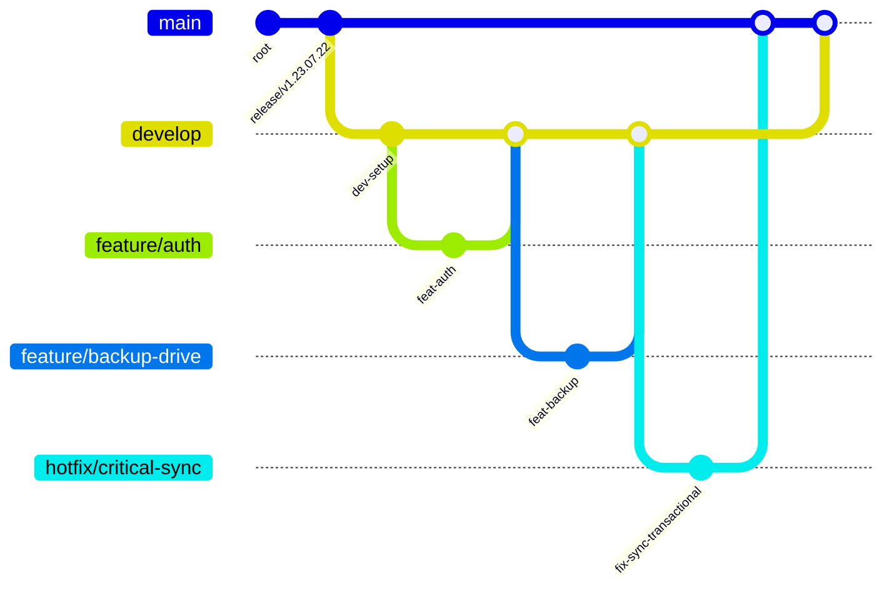
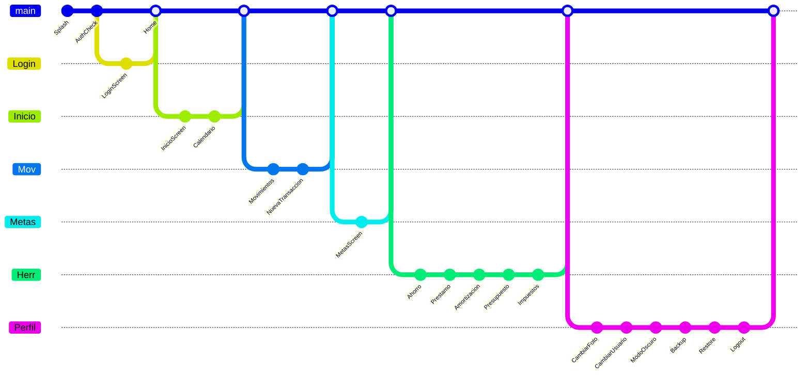

# 💰 HelpCoin — Plataforma Inteligente de Finanzas Personales y Colaborativas

  
  
  
  
  

---

## 🌟 ¿Qué es HelpCoin?

**HelpCoin** es un ecosistema financiero moderno diseñado para ofrecer **control total**, **privacidad instantánea**, **colaboración en tiempo real**, seguridad biométrica y una experiencia móvil optimizada en cada rincón.

Construido con **Kotlin + MVVM**, integra tecnologías como Firestore, Room, WorkManager, Google Drive API, sensores físicos, Lottie y más.

---

## ✨ Funciones Completas y Detalladas

### 📊 Gestión Financiera Avanzada

* Registro rápido de ingresos y gastos.
* Historial inteligente con filtros avanzados.
* Categorías personalizadas, emojis y colores.
* Dashboard con métricas automáticas.
* Optimización con coroutines y flujos.

### 🎯 Metas Inteligentes (Incluye Colaborativas en Tiempo Real)

* Metas individuales y metas colaborativas.
* Las metas colaborativas **se sincronizan en tiempo real** entre amigos.
* Progreso visual dinámico.
* Modo discreto aplicable también a metas.

### 🔄 Sincronización en Tiempo Real

* Firestore KTX para actualizaciones instantáneas.
* Modo colaborativo sin retrasos.

### 🕵️‍♂️ Modo Discreto + ShakeDetector

* Oculta toda la información financiera al instante.
* Se activa **agitando el celular**.
* Ocultamiento de movimientos, cifras, metas y categorías.
* Desaparición visual suave.

### 🤖 Motor NLP (Lenguaje Natural)

Puedes escribir:

> "meta viaje 2 millones"

y HelpCoin crea la meta automáticamente.

### ☁️ Backups Automáticos (Google Drive + Firebase)

* Backups automáticos en Google Drive.
* Respaldos completos del estado del usuario.
* Restauración completa.
* Encriptado básico.

### 🗄️ Base de Datos Local Inteligente

* Room con DAOs optimizados.
* Manejo híbrido local + nube.
* Caché avanzada.

### ⏰ Agenda + Recordatorios Integrados

* Recordatorios de pagos.
* Uso de `SCHEDULE_EXACT_ALARM`.
* Integración con WorkManager.

### 📱 Widget Inteligente

* Muestra información financiera resumida.
* Actualización automática.

### 🎨 Animaciones Modernas

* Lottie para transiciones.
* SplashScreen API moderna.

---

## 🛠️ Tecnologías y Funciones

| Logo                                                                                                                                                                    | Tecnología                 | Función                         |
| ----------------------------------------------------------------------------------------------------------------------------------------------------------------------- | -------------------------- | ------------------------------- |
|                                                       | **Kotlin 2.2.21**          | Lenguaje base y coroutines.     |
|                                                     | **Android SDK (API 36)**   | Ciclo de vida y compatibilidad. |
|                                         | **MVVM + LiveData**        | Arquitectura limpia.            |
|                                                       | **Room**                   | Base de datos local.            |
|                                                                                                       | **Navigation Component**   | Navegación segura.              |
|  | **Firebase BOM**           | Control global de versiones.    |
|                                                      | **Firebase Auth**          | Autenticación.                  |
|                                                                                                      | **Firestore**              | Tiempo real.                    |
|                                                                                                      | **Firebase Storage**       | Almacenamiento.                 |
|                                                                                                   | **Google Drive API**       | Backups.                        |
|                                                                                                   | **WorkManager**            | Tareas en segundo plano.        |
|                                                                                                        | **Coroutines**             | Asincronía.                     |
|                                                                                                         | **Biometric**              | Huella digital.                 |
|                                           | **Lottie**                 | Animaciones.                    |
|                                                         | **Glide**                  | Carga de imágenes.              |
|                                                                                                | **Material 3 + AppCompat** | UI moderna.                     |
|                                                                                                       | **SplashScreen API**       | Inicio moderno.                 |

---

## 📥 Descarga Oficial

➡️ **APK Oficial:** [https://helpcoinuan.site](https://helpcoinuan.site)

## 📄 Términos y Condiciones

➡️ [https://helpcoinuan.site/tyc](https://helpcoinuan.site/tyc)

---

## 👤 Autores

* Jeison Cadena
* Santiago Rodríguez
* Santiago Zipa
* Esteban Totaitive
* Yoseph Galvis

---

## 🌿 Branches & Flujo de Git (Rama del funcionamiento de la app)

### Flujo recomendado (Git Workflow)

* **main**: rama con releases estables. Solo se mergean releases y hotfixes.
* **develop**: rama principal de integración, contiene el código más reciente en desarrollo.
* **feature/***: ramas para nuevas funcionalidades (ej. `feature/metas-compartidas`). Se crean desde `develop` y se hacen PRs cuando estén listas.
* **hotfix/***: ramas para arreglos críticos en `main` (producción). Se mergean a `main` y luego a `develop`.
* **release/***: ramas para preparar una versión (fixes, documentación, pruebas). Se mergean a `main` y `develop`.

### Buenas prácticas

* Usar PRs (Pull Requests) con descripción, pasos para probar y etiquetas (bug / feature / docs).
* Añadir GitHub Actions para CI: linters, tests unitarios y build del APK.
* Usar `semantic-release` o tags semánticos para versionado automático.

---

## ✅ Extras añadidos

* Plantilla de CONTRIBUTING.md sugerida.
* Template para issues: `bug`, `feature request`, `documentation`.
* Recomendación de CI/CD (GitHub Actions) y badges: build, lint, tests.

---

Si quieres, añado ahora:

* El contenido de `CONTRIBUTING.md` y `ISSUE_TEMPLATE` listo para pegar.
* Un archivo `LICENSE` (MIT/Apache) y `CODE_OF_CONDUCT`.
* Badges de CI (GitHub Actions) y un banner gráfico.

Dime cuál de esos quieres que añada y lo incorporo directamente en el canvas.

---

# 📱 Flujo de Navegación (User Flow)

---

# 🔮 Funciones a Futuro (Roadmap Oficial)

## 🧠 Inteligencia Artificial Financiera

* Predicción de gastos.
* Recomendaciones automáticas.
* Alertas inteligentes por comportamiento.

## 👥 Metas Colaborativas 2.0

* Chat interno.
* Reacciones con emojis.
* Roles avanzados.

## 🏦 Conexión Bancaria (Open Banking)

* Importación automática de movimientos.
* Conciliación automática.

## 🔗 Integración con WhatsApp y Telegram

* Alertas y recordatorios por chat.
* Compartir metas grupales.

## 📲 Privacidad Avanzada

* Gestos secretos.
* Modo fantasma.
* Bloqueo invisible.

## 📊 Dashboard Web

* Panel administrativo.
* Estadísticas avanzadas.

## 🔐 Cifrado Avanzado

* AES‑256.
* Android Keystore.

## 🧩 Marketplace de Extensiones

* Calculadoras.
* Simuladores.
* Plugins externos.

## 🎛️ Automatizaciones

* Triggers financieros.

## 🏁 Sistema Premium

* IA avanzada.
* Temas.
* Prioridad de sincronización.

## 📌 Próximas Funciones Confirmadas

* Exportación de reportes PDF:
Genera informes descargables con el resumen de tus gastos.

* Soporte multi-moneda:
Registra gastos en diferentes monedas según tu país o proyecto.

* Gráficas avanzadas:
Visualizaciones más completas, interactivas y con análisis automático.
